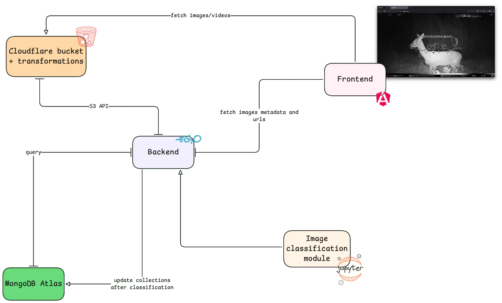

Edit or view the graph on Excalidraw using this [link](https://excalidraw.com/#json=-bW_xg-MqICFKOrtt7pIw,wIi6CyngwtC0LelmDbHNyQ).

Aculei project is divided into three components: the [backend](components/backend), the [frontend](components/frontend) and the [image classification](components/ai) module.

## Cloudflare buckets

Cloudflare buckets are used to efficiently store images. The database only stores the URI of a given image. When backend is requested to return a set of images it retrieves metadata from the database and produces images' URI . The frontend can retrieve images from cloudflare buckets using the URI provided by the backend.

### Transformations

We chose to use Cloudflare's [transformations via url](https://developers.cloudflare.com/images/transform-images/transform-via-url/) because the photos' standard dimensions were far larger than needed. Essentially, transformations are altered copies of the same picture, such as downsampled, blurred, or resized. Transformations allow for a notable increase in archive load speed and take advantage of Cloudflare's caching mechanism.

## MongoDB

The database is hosted as free-tier MongoDB Atlas instance. This allow room for experiments and a lot of flexibily during development and testing.

## Where is what?

- Frontend is deployed using [Cloudflare pages](https://pages.cloudflare.com/) to leverage all (amazing) Cloudflare functionalities.
- Backend is hosted on a [Digital Ocean droplet](https://www.digitalocean.com/products/droplets) running Ubuntu Linux. Backend code runs inside a docker container behind a Nginx Reverse Proxy.
- Database is hosted by [MongoDB Atlas](https://www.mongodb.com/lp/cloud/atlas/try4-reg) and accessed using Go drivers.
